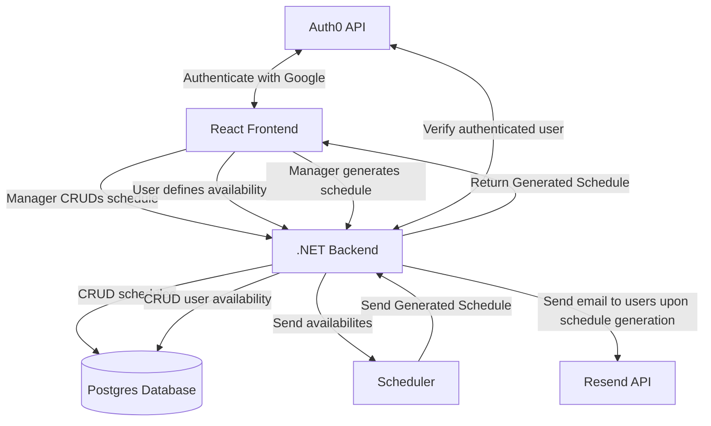

# LineUp

LineUp is a scheduling tool for when you need 100% coverage over a period of time.
It is designed to help teams ensure that everyone is available to work during any given period of time, whether for staffing a table or scheduling radio shows.

## Deployed Link

### [lineup.rem.bi](https://lineup.rem.bi/)

## Documentation

Frontend documentation can be found in [lineup-client/docs](lineup-client/docs/modules.md).

Backend documentation along with a web view of all documentation can be found at [rhyderswen.github.io/LineUp](https://rhyderswen.github.io/LineUp/)

## Usage Example

- A club president is planning tabling to advertise an upcoming event and needs to organize their committee members based on their availability
- They log in to LineUp using their username and password or Google account
- From the homepage, they click a button to create a new schedule, taking them to a form
- They enter the name ("Club Tabling"), the interval of time each shift should be divisible by (30 minutes), the duration of time to schedule for each day (11:00 AM to 5:00 PM), the dates to schedule for (April 27-May 1), and the number of people that should be working at the same time (2 people)
  - May also optionally choose to enter the maximum length of time a single person can work without a break (120 minutes) and the maximum number of shifts an individual can work (10 shifts)
- Once the schedule is created, their homepage is updated to include it in their list of schedules, including a link to its availability form
- The president shares the link with their committee members
- Each member fills out the availability form with their name, email, and selects the time blocks that they are available for
  - After submitting the form, they receive an email confirming their submission with a link to allow them to edit their availability
- Once the president has collected the availabilities, they decide to generate the schedule by clicking a button in the edit schedule page
- Once the algorithm generates the schedule, an email can be shared with all users who submitted their availability, summarizing their shift assignments and linking to the page displaying the generated schedule

## Quickstart

### Prerequisites

- [.NET 10](https://dotnet.microsoft.com/en-us/download)
- [Node.js](https://nodejs.org/en/download)
- [PNPM](https://pnpm.io/installation)
- [.NET Aspire CLI](https://aspire.dev/get-started/install-cli/)
- Docker or Podman (Podman is lighter-weight)

### Setup and Run

1. **Install backend dependencies**

   ```bash
   dotnet restore
   ```

   You will need to set the Resend API key with:

   ```bash
   aspire secret set Parameters:resend-api-key re_keygobbeldygook
   ```

   The app will still work but will not send emails.

2. **Install frontend dependencies**

   ```bash
   cd lineup-client
   cp .env.example .env # Make sure to populate .env!
   pnpm install
   ```

   > Note: If you need the API client to be generated, see the "API Client Generation" section below.

3. **Start the app, seeding with test data**

   ```bash
   SEED=true aspire run
   ```

   or for PowerShell users:

   ```powershell
   $env:SEED = "true"
   aspire run
   ```

Note: On subsequent runs, do not use the `SEED` flag, unless you want to re-seed the database (which will delete all existing data).

### Testing

To run the backend tests:

```bash
dotnet test
```

in the root of the repository.

To run the frontend tests:

```bash
pnpm test
```

in the [`lineup-client`](lineup-client) directory.

#### API Client Generation

To regenerate the API client after backend changes:

```bash
GEN=true aspire run
```

or for PowerShell users:

```powershell
$env:GEN = "true"
aspire run
```

## The Team

- Rhyder Swen
  - Frontend lead
  - Created Calendar component
  - Created Availability Entry/Final Schedule Viewing page
  - Integrated the backend with the frontend
- Joseph Markowski
  - Frontend support
  - Created Home, Schedule Creation, and Schedule Editing pages
  - Visual style, design, and logos
  - Primary frontend tester
- Eddie Rodriguez
  - Backend lead
  - Developed scheduling algorithm
  - Designed the API
  - Helped design database
- Luke Palios
  - Backend support
  - Helped design API
  - Designed database
  - Request to swap feature frontend and backend (493 Advanced Feature)

## Project Structure

- **[`lineup-client/`](lineup-client)** - React frontend
- **[`LineUp.Backend/`](LineUp.Backend)** - .NET backend API

- **[`LineUp.Core/`](LineUp.Core)** - Shared models and utilities
- **[`LineUp.Scheduler/`](LineUp.Scheduler)** - Scheduler logic
- **[`LineUp.EndToEndTests/`](LineUp.EndToEndTests)** - End-to-end tests
- **[`LineUp.MigrationService/`](LineUp.MigrationService)** - Database migration service (needed for Aspire)
- **[`LineUp.ServiceDefaults/`](LineUp.ServiceDefaults)** - Shared service defaults and logic for Aspire
- **[`LineUp.AppHost/`](LineUp.AppHost)** - Aspire app host



## Retrospective

This project taught us about the importance of teamwork in software engineering. There were multiple points throughout our project where one or more of us had to rely on our teammates to help us complete a task before a weekly meeting. In that way, it also taught us about the importance of timeliness. Whenever we were on the other side of that situation, and we were the ones being depended on, we were motivated to finish our addition in a timely manner so that the others could finish their tasks on time and with low stress. Working as a team also encouraged us to maintain a high standard of quality for our code, since we knew multiple people would need to understand and work with it.

It also taught us the skills for how to write code in a collaborative environment. For example, sticking to the Design Document and not just coding freely to ensure that the project falls in scope and is understandable to all. Additionally, we grew our skills in the React and C# languages, as well as software engineering-specific tools such as Vitest and xUnit and so many more.

## Versions

Postgres: 18.1

Moq: 4.20.72

## License

MIT License

Copyright (c) 2026 Rhyder Swen, Joseph Markowski, Eddie Rodriguez, Luke Palios.

For more information, see the [LICENSE](LICENSE) in the home directory.

## AI Usage

We used Claude to add in features for demo 4, most notably for the new local storage caching feature. The feature is intended for when people start filling out the availability form and refresh the page, their answers will now be be retained until they submit.

We gave Claude the relevant files (and only the relevant files) and asked it to add the feature. Additionally, we told it to add a comment next to each line it proposed changing. Then, instead of just copying-and-pasting, we went through each changed line to ensure that it was adding the functionality we wanted in a way that actually makes sense and only implemented that line once it made sense to us, asking Claude follow-up questions to ensure understanding of why it wrote the code the way it did.

Occassionally, we would ask why Claude would take a certain approach since we could think of clearer ways to do it, and it would rethink why it made those decisions and either explain why or redo the code in the paradigm we suggested instead. This was very helpful since it gave us ideas for potential ways to implement the feature we might not have otherwise thought about as well as an explaination as to when we might want to use that new approach going forward.

For the backend, we used Junie to refactor the scheduler to make it less monolithic.

We encouraged Junie to write extensive unit tests for the scheduler as it was making changes so that it did not inadvertently break functionality.

We also asked Junie to write more extensive unit tests for the schedule after the refactor, for easily breakable parts of the scheduler like enforcing shift lengths and counting shifts as a contiguous block of slots rather than one "slot".
