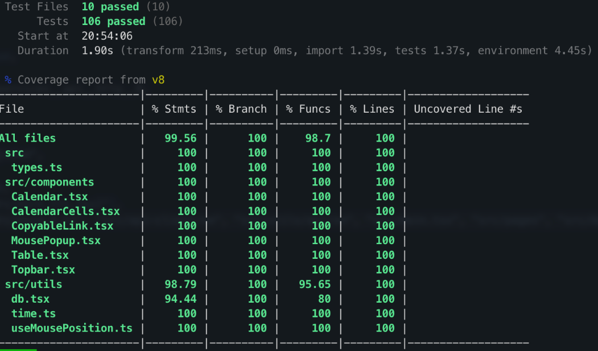

# Testing

In order to ensure that our software is as reliable as it can be, the developers behind LineUp have carefully orchestrated a testing architechture across all major functions, including tests that cover the frontend, backend, database, and integration.

## Test Locations

### Frontend

The frontend tests are located in [./lineup-client/src/testing](./lineup-client/src/testing). These tests cover:

- Rendering of the Calendar Component
- Rendering of the Calendar Cell Components and all their variations
- Monitoring the progress of a call to the database through toasts and ensure that the user can properly see the status of their request
- Rendering the correct information when moused over
- Rendering the Table Component
- Correct interactions with all time-related Component renderings
- Rendering the Top Bar Component

### Backend

The backend tests are located in [LineUp.Backend.Tests](LineUp.Backend.Tests). These tests cover:

- Creating, Reading, Updating, and Deleting the database objects
- Migrations, or alternatively the functionality that allows for the backend to interact with the Postgres database

Additional backend tests are located in [LineUp.EndToEndTests](LineUp.EndToEndTests) and [LineUp.Scheduler.Tests](LineUp.Scheduler.Tests). These tests cover:

- Full-stack connectivity and ensuring that all components can interact as desired in a full build
- Schedule Generation algorithm performance and reliability under high-volume and tightly-constrained scenarios

## Running the Tests

To run the frontend tests, open a new terminal and navigate to the `CSDS 393` directory that hosts this project.

- For the frontend tests, execute the commands

```
cd lineup-client
pnpm test
```

in the terminal. Once the tests have completed, you should see that all tests have passed and you will recieve a breakdown of the test coverage.

- For the backend tests, you first need to ensure that Docker Desktop is running. Once it is, execute the command

```
dotnet test
```

to run the tests. Once the tests have completed, you should see that all tests have succeeded.

# Coverage Report

_(493 Requirement)_

- Thanks to Vitest, our frontend tests will generate a coverage report after each successful test run. This report shows all of the files that ran code, the percent of lines that were involved in the tests, and any lines that may have been missed by the tests. An example can be seen below: 

This allowed us to ensure we were as thorough as possible in our testing, and it may also help any interested onlookers to be confident that our software is without oversights.
